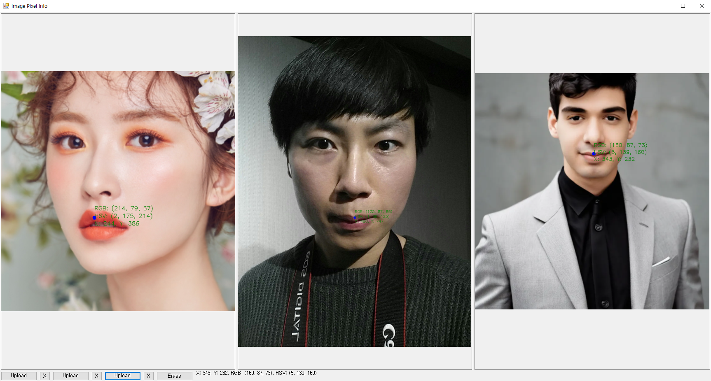

# ColorCompare - Pixel Value Inspector

Pixel Value Inspector is a powerful and user-friendly tool that allows you to obtain detailed color information from any image with just a click. Simply upload an image, click anywhere on it, and instantly see the RGB and HSV values at that specific point. This tool is designed for precision and ease of use, making it perfect for graphic designers, photographers, and anyone working with digital images.

## Features

- **Upload and View Images**: Easily upload up to three images simultaneously for comparison.
- **Click to Inspect**: Click on any point in the image to reveal its RGB and HSV color values.
- **Drag-and-Drop Support**: Conveniently drag and drop images directly into the application.
- **Delete and Clear**: Remove images or clear annotations with the click of a button.
- **Resizable Window**: The interface dynamically adjusts to window resizing for optimal viewing.

## Development Environment

- **IDE**: Visual Studio 2022
- **Operating System**: Windows 10

## How to Use

1. **Upload Images**: Click on the "Upload Image" buttons to upload up to three images. You can also drag and drop images directly into the application.
2. **Inspect Pixels**: Click on any point in the image to display the RGB and HSV values at that point. A small circle will appear at the clicked location to mark it.
3. **Delete Images**: Click the "X" button next to the "Upload Image" buttons to remove an image.
4. **Clear Annotations**: Click the "Erase" button to clear all annotations and restore the original images.

## Installation

To run Pixel Value Inspector, download the executable file from the provided link and run it on a Windows 10 system. No additional installation is required.

## License

This project is licensed under the MIT License - see the [LICENSE](LICENSE) file for details.

## Acknowledgements

- Developed using [OpenCvSharp](https://github.com/shimat/opencvsharp) for image processing.
- Special thanks to the Visual Studio 2022 IDE and its development community.

## Contact

For any questions, suggestions, or feedback, please contact [Your Name] at [psopen11@gmail.com].

---

Feel free to share Pixel Value Inspector with your friends and colleagues. Enhance your workflow with precise pixel color data at your fingertips.   

